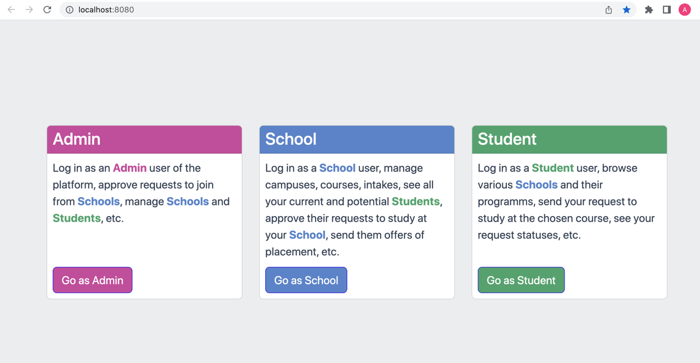

### It is a small web app, providing schools and students help with enrollment process. 

This project is **work in progress**. 
It's not finished yet.

Run `make init` to start the application.

It starts NGINX, PHP-FPM, PostgreSQL, and some more Docker containers, builds assets, runs DB migrations, starts to listen to connections on http://localhost:8080

App functionality so far 

You have 3 main sections - each is available only for specific roles.
You may travel to different sections from the main page.

You can create all 3 users in development by running command `make users` 

## School
You can create registration request as a School on page 
http://localhost:8080/school/register

Or log in as existed user for School - with email and password:
http://localhost:8080/school/login

school@school.school 
school

## Student
You can register as a Student on page 
http://localhost:8080/student/register

Or log in as existed user for School - with email and password:
http://localhost:8080/student/login

student@student.student 
student

## Admin
You can sign in as Admin user here 
http://localhost:8080/admin/login

_Email: admin@admin.admin 
Pass: admin_

Then you'll see all schools applications and you can confirm their registrations 
http://localhost:8080/admin/school

After every confirmation an email is sent to the school email address with an invitation link to set up their password and activate an account. 
Invitation link gets expired in 5 days.

### During the development

Run `make watch` to start yarn watch. That way you may instantly (-ish) see the result when you change js, scss, etc. files. 

# What's left to do before release

## Student

~~1. Create applications by students~~
   ~~1. Autocomplete, search for school~~
   ~~1. Autocomplete, search for course~~
   ~~1. Autocomplete, search for intake~~
   ~~1. Next step to fill out the form~~
   ~~1. Passport number, passport expiry, full name, preferred name, date of birth~~
~~1. See applications and statuses as student - reviewed, accepted, offer granted~~
1. See offer as student - download as pdf?
1. Save drafts, show last step on page reload
application_draft
   student_id
   created_at
   data
on application create - delete all drafts by userId

## School

1. See applications as school - list
1. Accept application as school
1. Send offer to student as school
1. See stats on dashboard as school - how many applications by month, by course

## Back

1. Add emails
1. Add logs
1. Add GA
1. Add fake data - generate schools, courses, intakes, students, applications

# Known issues
1. After login need to update app state on front, to get current logged in user email.